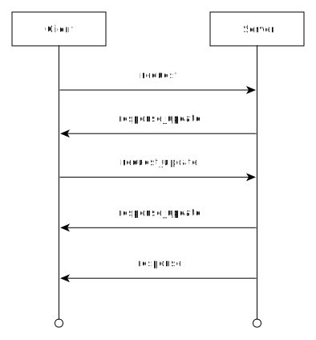

= Fizyr RPC

This document describes the RPC protocol used by Fizyr applications.
Each application implements its own unique interface on top of this RPC protocol.
Refer to the documentation of the application for the available services.

[[outline]]

== Outline

In the Fizyr RPC protocol, messages are sent between clients and a server.
In general, a Fizyr application acts as server while the customer implements a client.
After connecting to the server, clients can send `request` messages to the server for a specific service,
to which the server will reply with a `response` message when finished.
Before the `response` message arrives, update messages may be sent by either side.

The client can provide additional information belonging to a previously submitted request in the form of `request_update` messages.
This can be used to send large request data in chunks, for example.

The server can provide updates on a request made by the client in the form of `response_update` messages.
This can be used by the server to notify the client of progress before the final result is in.
One practical example is that the server can update the client to notify that the camera is done recording before the processing is done,
to indicate that a robot can move in view of the camera while the server continues processing.

Once a `response` message has been sent, the transaction has concluded and no more update messages may be transmitted for that request.

The `response` messages do not need to arrive in the order that the `request` messages were sent.
This allows peers to issue multiple requests in parallel without slower requests blocking quick requests.

In addition to request, response and update messages, the RPC protocol supports `notify` messages.
These can be used to send information to which no update or response messages are needed.

Figure below shows an example of a transaction between a server and client.

== RPC message layout

Each message has a header with a 32 bit `type`, `request_id` and `service_id`.
The `type` field indicates whether the message is a `request`, `response`, `request_update`,`response_update` or `notify`.
The `service_id` field identifies the requested action.
The `request_id` field is used to match updates and responses to the request that triggered them.

All fields are encoded in **little endian** to allow for cheap parsing on most common CPU types.

Update messages have the same `request_id` as the original request.
The `service_id` is set to 0 for update messages.
For `response` messages the `service_id` value indicates possible errors as negative values or zero indicating success.
Any remaining bytes in the message are service specific data.

The layout of an RPC message and it's header is illustrated in the table below.

[%header%unbreakable, width=100%, cols="20,10,70a"]
|===
<| Field
>| Size
<| Description

<| type
>| 4 bytes
<| The message type. See the table below.

<| request_id
>| 4 bytes
<| Chosen by request sender.

<| service_id
>| 4 bytes
<| Indicates the service being requested, or `error_code` for `response` messages.

<| data
>| N bytes
<| Service specific data.

|===

Message types and their values are illustrated below:

[%header%unbreakable, width=100%, cols="20,10"]
|===
<| Message Type
>| Value

<| request
>| 0

<| response
>| 1

<| request_update
>| 2

<| response_update
>| 3

<| notify
>| 4

|===

== RPC over TCP

TCP provides a reliable byte stream, but it does not provide message framing.
To parse individual messages from a TCP stream, an additional framing layer is added.

This framing consists of a 32 bit unsigned integer denoting the message length.
This length is excluding the size of the 32 bit integer itself.
The layout of a framed RPC message for TCP is illustrated in the table below.

[%header%unbreakable, width=100%, cols="20,10,70a"]
|===
<| Field
>| Size
<| Description

<| size
>| 4 bytes
<| Size of the message: N + 12.

<| RPC header
>| 12 bytes
<| RPC header.

<| data
>| N bytes
<| RPC message specific data.

|===

== Request ID allocation

The request ID can be chosen freely by the sender.
The server will copy the `ID` from the request to the `update` and `response` messages so that the client can match them with requests.
This allows the server to deliver responses in a different order from the original requests.
The client can use the request ID in the response to match the response with the correct request.

If the client has only one request pending at a time, the request ID field can be set to 0 for all messages.
If the client does execute multiple requests in parallel, but only one at a time for any given service,
the client could also use the service ID as the request ID.
In other cases, it is recommended to use an incrementing counter for the request ID.

== Example

As an example, the messages below show how a simple request for an echo service might look.
The server will response to an echo request by copying the data into a response.

**This example is not implemented in the Fizyr server, it is just a toy example.**

Example of the "echo" request message:

[%header%unbreakable, width=100%, cols="20,10,70a"]
|===
<| Field
>| Size
<| Value

<| size
>| 4 bytes
<| 23

<| type
>| 4 bytes
<| 0

<| request_id
>| 4 bytes
<| 21

<| service_id
>| 4 bytes
<| 0

<| data
>| 11 bytes
<| "Hello World"

|===

Example of the "echo" response message:

[%header%unbreakable, width=100%, cols="20,10,70a"]
|===
<| Field
>| Size
<| Value

<| size
>| 4 bytes
<| 23

<| type
>| 4 bytes
<| 1

<| request_id
>| 4 bytes
<| 21

<| service_id
>| 4 bytes
<| 0

<| data
>| 11 bytes
<| "Hello World"

|===

Suppose that the server encountered an error while processing the echo request, it could reply with an error response:

[%header%unbreakable, width=100%, cols="20,10,70a"]
|===
<| Field
>| Size
<| Value

<| size
>| 4 bytes
<| 37

<| type
>| 4 bytes
<| 1

<| request_id
>| 4 bytes
<| 21

<| service_id
>| 4 bytes
<| -1

<| data
>| 25 bytes
<| "failed to process request"

|===
